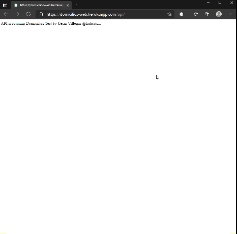

# [Domicilios](https://domicilios.herokuapp.com/api/)

Api Sitio Web Domicilios.

### URL

* [Status](https://domicilios.herokuapp.com/api/statuses) /api/statuses
* [Users] /api/users
* [Comment] /api/comments

[Ver](https://domicilios.herokuapp.com/api/).

### Recursos
* [Frontend Domicilios](https://github.com/Kulnois/domicilios-test-web)
* [Node](https://nodejs.org/en/)
* [Express](https://expressjs.com/)
* [Mongodb](https://mongoosejs.com/)
* [Mongoose](https://www.mongodb.com/)
* [bcryptjs]
* [jsonwebtoken](https://jwt.io/)

## Instalación
1. [Download](../../archive/master.zip) o clonar el repositorio.
2. Instalar dependencias con `npm install`.

## Server

### Desarrollo

Ejecutar `npm run server` e ir al navegador a la ruta [http://localhost:5000](http://localhost:5000).